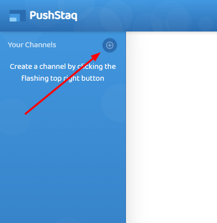
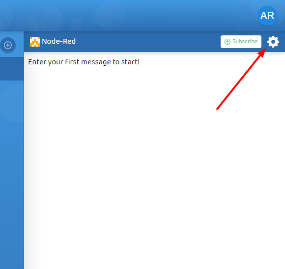
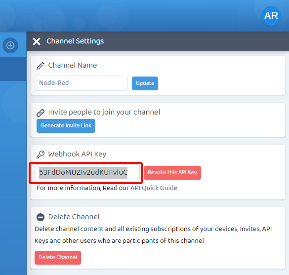

# node-red-contrib-pushstaq

This is the official PushStaq node for Node-Red.

With this node you can trigger and alert real time push notifications messages from your Node-Red flows to any device with PushStaq.

To use PushStaq you can quickly register at https://www.pushstaq.com and start pushing messages in less than a minute setup 📱🖥️🔥🚨

For a **full walkthrough** tutorial with End-to-end encryption tutorial at https://www.pushstaq.com/blog/node-red-push-notifications-with-pushstaq/

## Quick Setup Guidelines

### PushStaq

-   Sign in / Sign up at https://www.pushstaq.com and create a channel or select existing one you would like to push messages to from Node-Red.  
    

-   In the selected channel, click the top right settings icon to open the settings pane.  
    

-   In the Settings pane click the "Generate API Key" button, this will create a new API key you can copy to be used in Node-Red.  
    

-   To receive real time push notifications, login from the Desktop or Mobile device you wish to subscribe to and click the channel "Subscribe" button, on any new message in the channel you will receive a notification.

### Node-Red

-   Install this module in Node-Red and drag the node from the pallette.
-   Double click to edit node properties where inside you will need to paste the channel API key you copied from PushStaq channels settings pane and you are all set.

For any questions or bugs or requests please open a new [issue here](https://github.com/pantchox/node-red-contrib-pushstaq/issues/new)
